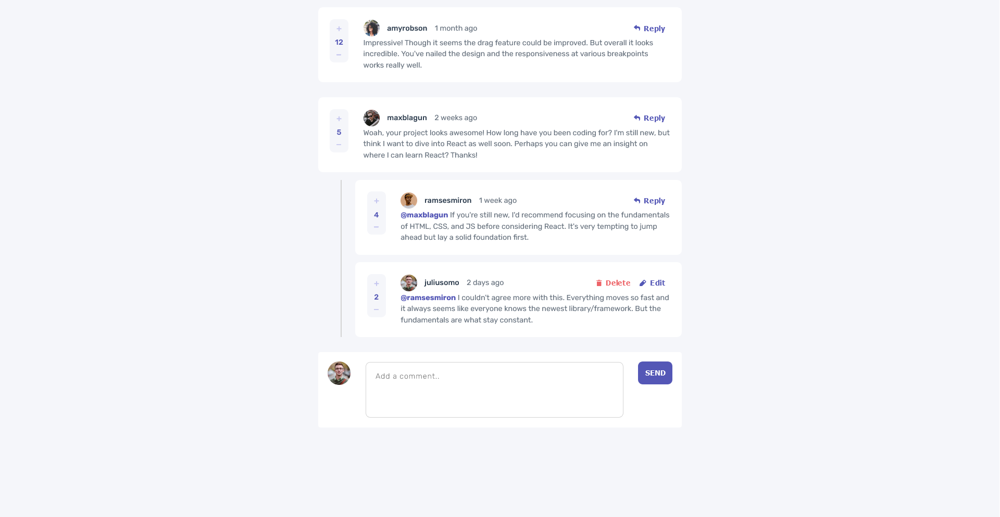

# Frontend Mentor - Interactive comments section solution

This is a solution to the [Interactive comments section challenge on Frontend Mentor](https://www.frontendmentor.io/challenges/interactive-comments-section-iG1RugEG9). Frontend Mentor challenges help you improve your coding skills by building realistic projects. 

## Table of contents

- [Overview](#overview)
  - [The challenge](#the-challenge)
  - [Screenshot](#screenshot)
  - [Links](#links)
- [My process](#my-process)
  - [Built with](#built-with)
  - [What I learned](#what-i-learned)
  - [Continued development](#continued-development)
  - [Useful resources](#useful-resources)
- [Author](#author)
- [Acknowledgments](#acknowledgments)

### The challenge

Users should be able to:

-✔️ View the optimal layout for the app depending on their device's screen size
-✔️ See hover states for all interactive elements on the page
-✔️ Create, Read, Update, and Delete comments and replies
-✔️ Upvote and downvote comments
-❌ **Bonus**: If you're building a purely front-end project, use `localStorage` to save the current state in the browser that persists when the browser is refreshed.
-❌ **Bonus**: Instead of using the `createdAt` strings from the `data.json` file, try using timestamps and dynamically track the time since the comment or reply was posted.

### Screenshot

## My process

- Built a <template> for the comments and other containers like for useroptions <button>. Grab a template whenever it satisfies a condition.

### Built with

- Semantic HTML5 markup
- CSS custom properties

### What I learned

- First time I learned <template>. On my previous works, I would just set the elements with "display: none", and clone that element but its selected for when <querySelector> is used. With <template>, I do not need to worry about such problems.

### Continued development

Unfortunately I've ran out of motivation on doing this project. I finished what I could finish and I just want to move to another project. 

### Useful resources

- [Asaeneh's 30 Day of JavaScript](https://github.com/Asabeneh/30-Days-Of-JavaScript)

## Author

- [Github](https://github.com/Justinjovert/)
- Frontend Mentor - [Justinjovert](https://www.frontendmentor.io/profile/Justinjovert)

## Acknowledgments

Frontend Mentor and Asabeneh Yetayeh.
